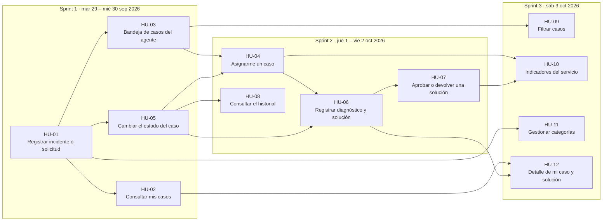

# Product Backlog

Parte del backlog que entregó el docente (`docs/recursos/backlog_CampusHelp.csv`). Lo refinamos agregando reglas de negocio, criterios de aceptación, dependencias, pruebas y tareas técnicas. Cada historia tiene su ficha en [backlog/](backlog/) y su issue en el tablero; el estado real siempre es el del tablero, esta tabla es la foto inicial.

Como estimación inicial se tomaron los Story Points sugeridos por el docente (escala 1, 2, 3, 5, 8, 13). El equipo los confirma o ajusta con Planning Poker en la primera Planning, y cualquier cambio queda anotado en el documento del sprint.

## Sprints simulados

Tenemos cinco días (martes 29 de septiembre a sábado 3 de octubre), así que los tres sprints del taller se simulan comprimidos: Sprint 1 el 29 y 30 de septiembre, Sprint 2 el 1 y 2 de octubre y Sprint 3 el 3 de octubre. Las historias siguen amarradas a su sprint (milestone y campo `Sprint` del tablero) y los seis integrantes desarrollan en paralelo siguiendo las dependencias de abajo.

## Historias

| ID | Historia | Prioridad | SP | Sprint | Depende de | Issue | Estado inicial |
|---|---|---|---|---|---|---|---|
| [HU-01](backlog/HU-01.md) | Registrar incidente o solicitud | P1 | 5 | 1 | – | [#1](https://github.com/CristianGarcia21/sw3-frontend/issues/1) | Ready |
| [HU-02](backlog/HU-02.md) | Consultar mis casos | P1 | 3 | 1 | HU-01 | [#10](https://github.com/CristianGarcia21/sw3-frontend/issues/10) | Ready |
| [HU-03](backlog/HU-03.md) | Bandeja de casos del agente | P1 | 3 | 1 | HU-01 | [#14](https://github.com/CristianGarcia21/sw3-frontend/issues/14) | Ready |
| [HU-04](backlog/HU-04.md) | Asignarme un caso | P1 | 3 | 2 | HU-03, HU-05 | [#24](https://github.com/CristianGarcia21/sw3-frontend/issues/24) | Product Backlog |
| [HU-05](backlog/HU-05.md) | Cambiar el estado del caso | P1 | 5 | 1 | HU-01 | [#18](https://github.com/CristianGarcia21/sw3-frontend/issues/18) | Ready |
| [HU-06](backlog/HU-06.md) | Registrar diagnóstico y solución | P1 | 5 | 2 | HU-04, HU-05 | [#28](https://github.com/CristianGarcia21/sw3-frontend/issues/28) | Product Backlog |
| [HU-07](backlog/HU-07.md) | Aprobar o devolver una solución | P1 | 5 | 2 | HU-06 | [#32](https://github.com/CristianGarcia21/sw3-frontend/issues/32) | Product Backlog |
| [HU-08](backlog/HU-08.md) | Consultar el historial | P2 | 5 | 2 | HU-05 | [#36](https://github.com/CristianGarcia21/sw3-frontend/issues/36) | Product Backlog |
| [HU-09](backlog/HU-09.md) | Filtrar casos | P2 | 3 | 3 | HU-03 | [#40](https://github.com/CristianGarcia21/sw3-frontend/issues/40) | Product Backlog |
| [HU-10](backlog/HU-10.md) | Indicadores del servicio | P2 | 5 | 3 | HU-04, HU-07 | [#44](https://github.com/CristianGarcia21/sw3-frontend/issues/44) | Product Backlog |
| [HU-11](backlog/HU-11.md) | Gestionar categorías | P2 | 3 | 3 | HU-01 | [#49](https://github.com/CristianGarcia21/sw3-frontend/issues/49) | Product Backlog |
| [HU-12](backlog/HU-12.md) | Detalle de mi caso y solución | P3 | 3 | 3 | HU-02, HU-06 | [#53](https://github.com/CristianGarcia21/sw3-frontend/issues/53) | Product Backlog |

Total: 48 SP. Sprint 1: 16 SP, Sprint 2: 18 SP, Sprint 3: 14 SP.

## Dependencias entre historias

Una flecha `A → B` significa que B necesita que A esté terminada (o al menos su parte de backend). En GitHub cada issue muestra estas relaciones en la sección **Relationships** como "Blocked by" / "Blocking".

Decisiones sobre el orden:

- HU-05 (Sprint 1) va antes que HU-04 (Sprint 2), aunque pasar a `En atención` necesita agente asignado. En Sprint 1 se construye la máquina de estados completa y en Sprint 2, con HU-04, se activa la regla RN-11. Así el Sprint 1 ya muestra transiciones válidas e inválidas.
- HU-08 queda en Sprint 2, pero los eventos de historial se guardan desde el Sprint 1 (HU-01 y HU-05). En Sprint 2 se consultan y se muestran.
- Las áreas y categorías iniciales entran como datos semilla en HU-01. La administración de categorías (HU-11) puede esperar al Sprint 3 sin bloquear nada.
- El Sprint 3 dura un día; por eso sus historias se eligieron de forma que casi todas dependen solo de trabajo de sprints anteriores y se pueden hacer a la vez.

## Orden de trabajo por tareas

Cada tarea es una sub-issue de su historia y tiene sus bloqueos marcados en GitHub. La **oleada** dice cuándo se puede empezar dentro del sprint: la oleada 1 arranca apenas empieza el sprint, la 2 cuando termina lo que la bloquea en la 1, y así.

Mientras una tarea está bloqueada, su responsable no se queda quieto:

- En frontend se puede construir la pantalla con datos simulados siguiendo el contrato de [03-api.md](03-api.md) y conectarla cuando el endpoint esté listo.
- En backend se pueden escribir los esquemas Zod y las rutas antes de que el modelo esté migrado.
- Si no hay nada que adelantar, se ayuda a revisar PRs o a probar lo que está en validación (regla del WIP).

BD y Backend se programan en `sw3-backend`; Frontend en este repo. Cada historia la prueba alguien que no la desarrolló.

### Sprint 1 · mar 29 – mié 30 sep 2026

| Oleada | Historia | Área | Tarea | Responsable | Bloqueada por | Issue |
|---|---|---|---|---|---|---|
| 1 | HU-01 | BD | Modelo Prisma del dominio y migración inicial | Tania Botina | – (puede empezar ya) | [#2](https://github.com/CristianGarcia21/sw3-frontend/issues/2) |
| 1 | HU-01 | Frontend | Base del frontend: rutas, layout, cliente API y selector de usuario de prueba | Cristian García | – (puede empezar ya) | [#6](https://github.com/CristianGarcia21/sw3-frontend/issues/6) |
| 2 | HU-01 | BD | Seed de áreas, categorías y usuarios de prueba | Juan Fernando | [#2](https://github.com/CristianGarcia21/sw3-frontend/issues/2) | [#3](https://github.com/CristianGarcia21/sw3-frontend/issues/3) |
| 2 | HU-01 | Backend | Endpoints GET /usuarios, /areas y /categorias | Juan Fernando | [#2](https://github.com/CristianGarcia21/sw3-frontend/issues/2) | [#4](https://github.com/CristianGarcia21/sw3-frontend/issues/4) |
| 2 | HU-01 | Backend | POST /casos con validaciones y evento CREACION | Juan José | [#2](https://github.com/CristianGarcia21/sw3-frontend/issues/2) | [#5](https://github.com/CristianGarcia21/sw3-frontend/issues/5) |
| 3 | HU-01 | Frontend | Formulario de registro de caso | Valentina Galvis | [#6](https://github.com/CristianGarcia21/sw3-frontend/issues/6), [#4](https://github.com/CristianGarcia21/sw3-frontend/issues/4) | [#7](https://github.com/CristianGarcia21/sw3-frontend/issues/7) |
| 3 | HU-01 | Documentación | README con pasos para correr backend y frontend juntos | Juan Fernando | [#3](https://github.com/CristianGarcia21/sw3-frontend/issues/3), [#6](https://github.com/CristianGarcia21/sw3-frontend/issues/6) | [#9](https://github.com/CristianGarcia21/sw3-frontend/issues/9) |
| 3 | HU-02 | Backend | GET /casos filtrado por solicitante (RN-20) | Tania Botina | [#5](https://github.com/CristianGarcia21/sw3-frontend/issues/5) | [#11](https://github.com/CristianGarcia21/sw3-frontend/issues/11) |
| 3 | HU-03 | Backend | Orden de bandeja y filtros de no cerrados / asignados a mí | Juan Fernando | [#5](https://github.com/CristianGarcia21/sw3-frontend/issues/5) | [#15](https://github.com/CristianGarcia21/sw3-frontend/issues/15) |
| 3 | HU-05 | Backend | Máquina de estados y PATCH /casos/{id}/estado | Juan José | [#5](https://github.com/CristianGarcia21/sw3-frontend/issues/5) | [#19](https://github.com/CristianGarcia21/sw3-frontend/issues/19) |
| 3 | HU-05 | Backend | PATCH /casos/{id}/clasificacion (RN-08) | Tania Botina | [#5](https://github.com/CristianGarcia21/sw3-frontend/issues/5) | [#20](https://github.com/CristianGarcia21/sw3-frontend/issues/20) |
| 4 | HU-01 | Pruebas | Ejecutar CP-01, CP-02, CP-03 y CP-11 | Juan Diego | [#3](https://github.com/CristianGarcia21/sw3-frontend/issues/3), [#5](https://github.com/CristianGarcia21/sw3-frontend/issues/5), [#7](https://github.com/CristianGarcia21/sw3-frontend/issues/7) | [#8](https://github.com/CristianGarcia21/sw3-frontend/issues/8) |
| 4 | HU-02 | Frontend | Pantalla Mis casos | Juan Diego | [#6](https://github.com/CristianGarcia21/sw3-frontend/issues/6), [#11](https://github.com/CristianGarcia21/sw3-frontend/issues/11) | [#12](https://github.com/CristianGarcia21/sw3-frontend/issues/12) |
| 4 | HU-03 | Frontend | Pantalla Bandeja del agente | Cristian García | [#6](https://github.com/CristianGarcia21/sw3-frontend/issues/6), [#15](https://github.com/CristianGarcia21/sw3-frontend/issues/15) | [#16](https://github.com/CristianGarcia21/sw3-frontend/issues/16) |
| 4 | HU-05 | Frontend | Detalle del caso para el agente con acciones de estado | Valentina Galvis | [#6](https://github.com/CristianGarcia21/sw3-frontend/issues/6), [#19](https://github.com/CristianGarcia21/sw3-frontend/issues/19) | [#21](https://github.com/CristianGarcia21/sw3-frontend/issues/21) |
| 5 | HU-02 | Pruebas | Ejecutar CP-12 | Valentina Galvis | [#12](https://github.com/CristianGarcia21/sw3-frontend/issues/12) | [#13](https://github.com/CristianGarcia21/sw3-frontend/issues/13) |
| 5 | HU-03 | Pruebas | Ejecutar CP-13 y la parte de bandeja de CP-01 | Tania Botina | [#16](https://github.com/CristianGarcia21/sw3-frontend/issues/16) | [#17](https://github.com/CristianGarcia21/sw3-frontend/issues/17) |
| 5 | HU-05 | Frontend | Diálogo de reclasificación (tipo, categoría, prioridad) | Juan Diego | [#21](https://github.com/CristianGarcia21/sw3-frontend/issues/21), [#20](https://github.com/CristianGarcia21/sw3-frontend/issues/20) | [#22](https://github.com/CristianGarcia21/sw3-frontend/issues/22) |
| 6 | HU-05 | Pruebas | Ejecutar CP-04, CP-05 y CP-15 | Juan Fernando | [#21](https://github.com/CristianGarcia21/sw3-frontend/issues/21), [#22](https://github.com/CristianGarcia21/sw3-frontend/issues/22) | [#23](https://github.com/CristianGarcia21/sw3-frontend/issues/23) |
### Sprint 2 · jue 1 – vie 2 oct 2026

| Oleada | Historia | Área | Tarea | Responsable | Bloqueada por | Issue |
|---|---|---|---|---|---|---|
| 1 | HU-04 | Backend | PATCH /casos/{id}/asignar y regla RN-11 | Tania Botina | [#19](https://github.com/CristianGarcia21/sw3-frontend/issues/19) | [#25](https://github.com/CristianGarcia21/sw3-frontend/issues/25) |
| 1 | HU-08 | Backend | GET /casos/{id}/historial con permisos | Juan José | [#19](https://github.com/CristianGarcia21/sw3-frontend/issues/19) | [#37](https://github.com/CristianGarcia21/sw3-frontend/issues/37) |
| 2 | HU-04 | Frontend | Botón Asignarme y selector de agente | Cristian García | [#16](https://github.com/CristianGarcia21/sw3-frontend/issues/16), [#21](https://github.com/CristianGarcia21/sw3-frontend/issues/21), [#25](https://github.com/CristianGarcia21/sw3-frontend/issues/25) | [#26](https://github.com/CristianGarcia21/sw3-frontend/issues/26) |
| 2 | HU-06 | Backend | POST /casos/{id}/atencion y regla RN-13 | Juan José | [#25](https://github.com/CristianGarcia21/sw3-frontend/issues/25) | [#29](https://github.com/CristianGarcia21/sw3-frontend/issues/29) |
| 2 | HU-08 | Frontend | Línea de tiempo del historial en el detalle | Cristian García | [#21](https://github.com/CristianGarcia21/sw3-frontend/issues/21), [#37](https://github.com/CristianGarcia21/sw3-frontend/issues/37) | [#38](https://github.com/CristianGarcia21/sw3-frontend/issues/38) |
| 3 | HU-04 | Pruebas | Ejecutar CP-06 y CP-14 | Juan Diego | [#26](https://github.com/CristianGarcia21/sw3-frontend/issues/26) | [#27](https://github.com/CristianGarcia21/sw3-frontend/issues/27) |
| 3 | HU-06 | Frontend | Formulario de diagnóstico y solución | Juan Diego | [#21](https://github.com/CristianGarcia21/sw3-frontend/issues/21), [#29](https://github.com/CristianGarcia21/sw3-frontend/issues/29) | [#30](https://github.com/CristianGarcia21/sw3-frontend/issues/30) |
| 3 | HU-07 | Backend | POST /casos/{id}/validacion | Juan Fernando | [#29](https://github.com/CristianGarcia21/sw3-frontend/issues/29) | [#33](https://github.com/CristianGarcia21/sw3-frontend/issues/33) |
| 4 | HU-06 | Pruebas | Ejecutar CP-07 y CP-16 | Valentina Galvis | [#30](https://github.com/CristianGarcia21/sw3-frontend/issues/30) | [#31](https://github.com/CristianGarcia21/sw3-frontend/issues/31) |
| 4 | HU-07 | Frontend | Bandeja y pantalla de validación | Valentina Galvis | [#6](https://github.com/CristianGarcia21/sw3-frontend/issues/6), [#33](https://github.com/CristianGarcia21/sw3-frontend/issues/33) | [#34](https://github.com/CristianGarcia21/sw3-frontend/issues/34) |
| 4 | HU-08 | Pruebas | Ejecutar CP-18 | Juan Fernando | [#38](https://github.com/CristianGarcia21/sw3-frontend/issues/38), [#33](https://github.com/CristianGarcia21/sw3-frontend/issues/33) | [#39](https://github.com/CristianGarcia21/sw3-frontend/issues/39) |
| 5 | HU-07 | Pruebas | Ejecutar CP-08, CP-09 y CP-17 | Cristian García | [#34](https://github.com/CristianGarcia21/sw3-frontend/issues/34) | [#35](https://github.com/CristianGarcia21/sw3-frontend/issues/35) |
### Sprint 3 · sáb 3 oct 2026

| Oleada | Historia | Área | Tarea | Responsable | Bloqueada por | Issue |
|---|---|---|---|---|---|---|
| 1 | HU-11 | Backend | CRUD de /categorias (RN-21, RN-22) | Juan Fernando | [#4](https://github.com/CristianGarcia21/sw3-frontend/issues/4) | [#50](https://github.com/CristianGarcia21/sw3-frontend/issues/50) |
| 2 | HU-09 | Backend | Filtros combinables en GET /casos e índices | Tania Botina | [#15](https://github.com/CristianGarcia21/sw3-frontend/issues/15) | [#41](https://github.com/CristianGarcia21/sw3-frontend/issues/41) |
| 2 | HU-11 | Frontend | Pantalla de administración de categorías | Valentina Galvis | [#50](https://github.com/CristianGarcia21/sw3-frontend/issues/50) | [#51](https://github.com/CristianGarcia21/sw3-frontend/issues/51) |
| 3 | HU-09 | Frontend | Barra de filtros sincronizada con la URL | Juan Diego | [#16](https://github.com/CristianGarcia21/sw3-frontend/issues/16), [#41](https://github.com/CristianGarcia21/sw3-frontend/issues/41) | [#42](https://github.com/CristianGarcia21/sw3-frontend/issues/42) |
| 3 | HU-11 | Pruebas | Ejecutar CP-21 | Cristian García | [#51](https://github.com/CristianGarcia21/sw3-frontend/issues/51) | [#52](https://github.com/CristianGarcia21/sw3-frontend/issues/52) |
| 4 | HU-09 | Pruebas | Ejecutar CP-10 y CP-19 | Juan José | [#42](https://github.com/CristianGarcia21/sw3-frontend/issues/42) | [#43](https://github.com/CristianGarcia21/sw3-frontend/issues/43) |
| 4 | HU-12 | Backend | GET /casos/{id} con atenciones y permiso de solicitante | Tania Botina | [#29](https://github.com/CristianGarcia21/sw3-frontend/issues/29) | [#54](https://github.com/CristianGarcia21/sw3-frontend/issues/54) |
| 5 | HU-10 | Backend | GET /indicadores con consultas agregadas | Juan José | [#25](https://github.com/CristianGarcia21/sw3-frontend/issues/25), [#33](https://github.com/CristianGarcia21/sw3-frontend/issues/33) | [#45](https://github.com/CristianGarcia21/sw3-frontend/issues/45) |
| 5 | HU-12 | Frontend | Detalle del caso para el solicitante | Valentina Galvis | [#54](https://github.com/CristianGarcia21/sw3-frontend/issues/54), [#38](https://github.com/CristianGarcia21/sw3-frontend/issues/38) | [#55](https://github.com/CristianGarcia21/sw3-frontend/issues/55) |
| 6 | HU-10 | Frontend | Pantalla de indicadores | Cristian García | [#45](https://github.com/CristianGarcia21/sw3-frontend/issues/45) | [#46](https://github.com/CristianGarcia21/sw3-frontend/issues/46) |
| 6 | HU-10 | Documentación | Documentar cómo se calcula cada indicador | Juan Fernando | [#45](https://github.com/CristianGarcia21/sw3-frontend/issues/45) | [#48](https://github.com/CristianGarcia21/sw3-frontend/issues/48) |
| 6 | HU-12 | Pruebas | Ejecutar CP-22 y CP-23 | Juan Diego | [#55](https://github.com/CristianGarcia21/sw3-frontend/issues/55) | [#56](https://github.com/CristianGarcia21/sw3-frontend/issues/56) |
| 7 | HU-10 | Pruebas | Ejecutar CP-20 | Tania Botina | [#46](https://github.com/CristianGarcia21/sw3-frontend/issues/46) | [#47](https://github.com/CristianGarcia21/sw3-frontend/issues/47) |

### Carga por persona

| Integrante | Desarrollo | Pruebas | Documentación | Total | Rol adicional |
|---|---|---|---|---|---|
| Juan Fernando | 5 | 2 | 2 | 9 | Product Owner |
| Tania Botina | 6 | 2 | 0 | 8 | Scrum Master |
| Cristian García | 5 | 2 | 0 | 7 | – |
| Valentina Galvis | 5 | 2 | 0 | 7 | – |
| Juan Diego | 4 | 3 | 0 | 7 | QA |
| Juan José | 5 | 1 | 0 | 6 | – |

Juan José tiene una tarea menos porque las suyas son las más pesadas (POST /casos, máquina de estados, atención, indicadores) y además revisa los PR de backend; Cristian revisa los de frontend. Tania facilita las ceremonias y Juan Fernando lleva las métricas y la documentación de cada sprint: issues [#57](https://github.com/CristianGarcia21/sw3-frontend/issues/57), [#58](https://github.com/CristianGarcia21/sw3-frontend/issues/58) y [#59](https://github.com/CristianGarcia21/sw3-frontend/issues/59).
